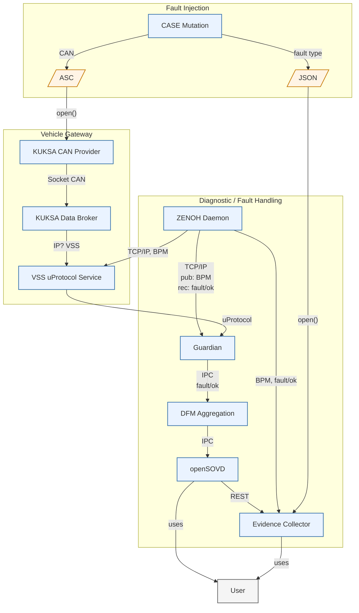

# Plan

## Initial Target Architecture

## Fault Injector/Case Mutator

**Idea**

- Replace the demo's direct uProtocol fault publisher with CAN-level fault injection.
- Generate a good and a  number of `battery_temp.asc` inputs for each campaign.
- Exercise the complete production path:
  - ASC replay
  - KUKSA CAN Provider
  - KUKSA Databroker
  - VSS-to-uProtocol bridge
  - Guardian
  - DFM and OpenSOVD
- Keep fault models separated by injection layer.
- Treat Guardian, DFM, and OpenSOVD as correct components in the initial phase.

#### Differences from the Current Demo

- Do not publish synthetic `BatteryTempEvent` messages directly to the Guardian.
- Do not bypass CAN decoding, VSS mapping, or the VSS bridge.
- Use ASC variants (**i.e., modified replays**) as the primary campaign artifacts.
- Drop Toxiproxy (may only be relevant for transport-specific campaigns).
- Treat diagnostic fault classes as later extensions, not initial requirements.
- Replace the current implicit scenario switch with explicit, reproducible campaign inputs and expected results.

#### Step 1 — Input and Source Faults

- Inject faults by modifying `battery_temp.asc` (i.e. replay is modified).
- Initial campaigns:
    - Faults in Values (i.e., seq-nr, min, max, average, charge)
    - Faults in Transport (i.e., delay, dropout/lost)
- **Systematic injection experiments**
    - *Mutation is done base on current values and mutation rules*
    - Config file to specify physically correct behavior and 
  - Faults: Value stuck, value implausible
  - Campaigns interate replay frame (messages)
- Verify Guardian detection through DFM and OpenSOVD.
- Record input trace, expected fault, observed fault, and verdict.

#### Step 2 — Guardian Detection Faults

- Inject faults into the detection and classification behavior separately from CAN input faults.
- Candidate campaigns:
  - delayed detection
  - missed threshold crossing
  - incorrect fault ID or severity mapping
  - incorrect recovery or fault clearing
- Compare expected Guardian output with reported DFM records.

#### Step 3 — Diagnostic Chain Faults

- Start with a correctly detected and classified Guardian fault.
- Inject faults after the Guardian:
  - delayed DFM write
  - dropped DFM record
  - partial OpenSOVD visibility
  - stale or inconsistent diagnostic state
- Verify that diagnostic-chain failures can be distinguished from Guardian failures.
- Use dedicated injection mechanisms for DFM/OpenSOVD; do not model these through ASC changes.

#### Initial Deliverable

- Implement Step 1 only.
- Provide one ASC artifact per campaign.
- Run every campaign through the full CAN-to-OpenSOVD path.
- Produce a repeatable evidence report with pass/fail verdicts.
- Document Steps 2 and 3 as planned extensions.

## Kuksa CAN provider and data broker

just use

## VSS protocol publisher

just use

## Battery Thermal Guardian

### Planned Diagnoses

- We switch to a rule-based detection
- Physical model replaces static thresholds
    - Delta(min,max), Epsilon(min,avg,max) are modelled by functions
    - Guardian uses model the compute state-dependend thresholds
    - This generalises checks to a proper specification
- 1. bus diagnosis
    - message loss
    - message repetition
    - bus timeout
- 2. sensor data diagnosis
    - implausible
    - sensor stuck
    - sensor drift
3. battery diagnosis
    - overtemperature
    - undertemperature
    - thermal runaway

reports to DFM via fault_lib

## DFM

just use (fault catalogue from guardian)

## OpenSOVD

just use

## Evidence collector

- Gets data (i.e., faults injected) from campaign supervisor or - in the inital steps - from the case mutator (i.e., accesses mutated `.asc`).
- Compares reported evidence (i.e., faults detected by guardian) against ground truth.

## Campaign supervisor

maybe later OpenDuT, instruments and orchestrates fault injector/case mutator.
