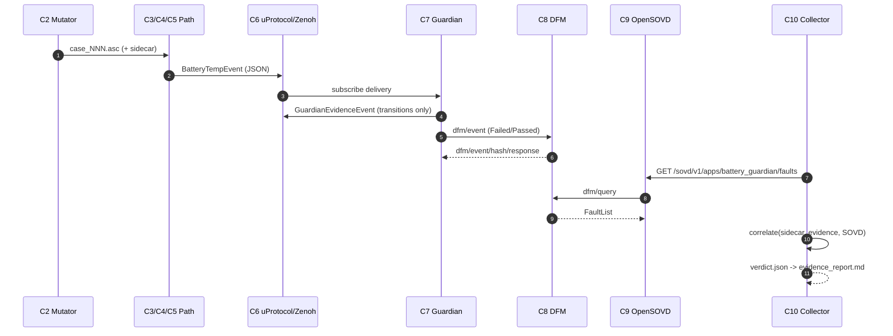

# Component & Channel Specification — Battery Thermal Guardian Evidence Factory

Companion to `product/doc/battery/battery_guardian_model.md` (physical model).
Short per item: this document specifies *wiring* — who produces/consumes what,
over which channel and protocol, with which payload.

Status: **[DEMO]** exists in `demo/`, **[PLANNED]** designed, not built,
**[DEFERRED]** out of v1, **[RESOLVED]** decided (ADR).

## 1. Scope & conventions

- **Scope v1.** `ASC → CAN Provider → Data Broker → VSS Publisher → Guardian →
  DFM → OpenSOVD → Evidence Collector`. openDuT (C11) and Ankaios (C12) are
  documented only (ADR-006).
- **Authority.** README (DoD) = acceptance; ADRs = binding. Canonical fault-class
  registry: `product/interfaces/battery_fault_contract.yaml` + `battery_guardian_model.md`
  (ADR-005); demo catalog superseded.
- **Time base (ADR-013, supersedes ADR-008 and the receive-time base of ADR-004).**
  No sequence numbers anywhere. The zero-based source-relative `timestamp_ms` is
  the pipeline-wide common time base and is carried unchanged through every
  component. The model distinguishes the **source/generation interval** `Δτ`
  (rate, thermal/SoC dynamics) from the **receive interval** `Δt_recv` projected
  onto the same base (freshness/age, drop/jitter, duplicate/reorder); they share
  one axis but are different quantities.
- **Units.** `T` in °C, `SoC` in `pp`, `Δt = 100 ms`, `q_T = 0.5 °C`, `q_SoC = 0.5 pp`.
- **Correlation (ADR-007).** `run_id` enters the Guardian via startup configuration;
  per-case correlation uses `injected_at_ms` + a time window in the Collector.
- **v1 interface decisions:** mitigation M1 (event-only), DFM IPC = iceoryx2,
  report = `verdict.json` → Markdown, transport faults = Toxiproxy (ADR-007).

## 2. Component overview

| ID | Component | Status | Responsibility (one line) |
|----|-----------|--------|---------------------------|
| C1 | Source asset (ASC case) | [DEMO] | Replayable CAN FD frame file; the campaign artifact. |
| C2 | Case Mutator / Fault Injector | [DEMO] | Mutates CAN FD ASC template → replay, ground truth, and oracle. |
| C3 | KUKSA CAN Provider | [DEMO] | Replays ASC, decodes DBC, maps to VSS, writes Data Broker. |
| C4 | KUKSA Data Broker | [DEMO] | VSS signal tree; gRPC reads/subscriptions. |
| C5 | VSS uProtocol Publisher (`vss_bridge`) | [DEMO] | Data Broker → uProtocol/Zenoh `BatteryTempEvent`. |
| C6 | uProtocol bus over Zenoh | [DEMO] | Pub/sub backbone; all Guardian I/O. |
| C7 | Battery Thermal Guardian | [DEMO] | Physical model + evidence + DFM reporting. |
| C8 | Diagnostic Fault Manager (DFM) | [DEMO] | Fault/DTC lifecycle store; serves `dfm/query`. |
| C9 | OpenSOVD Gateway | [DEMO] | Exposes DFM faults as SOVD HTTP. |
| C10 | Evidence Collector | [PLANNED] | Correlates ground truth + evidence + diagnostics → verdict. |
| C11 | Campaign Supervisor (openDuT) | [DEFERRED] | Orchestrates campaigns; remote reruns (v2). |
| C12 | Ankaios | [DEFERRED] | Workload lifecycle / AutoSD run (v2). |
| C13 | Test harness (Robot) | [DEMO] | Transitional driver until C10 exists. |
| C14 | Transport fault injector (Toxiproxy) | [DEMO] | Injects delay/drop on the C5→C7 Zenoh link. |
| C15 | Mitigation Actuator (mock) | [DEFERRED] | Closed-loop mitigation (M2) — not in v1. |

## 3. Edge overview

| ID | From → To | Channel | Protocol / addressing | Status |
|----|-----------|---------|-----------------------|--------|
| E1 | C2 → C1 | file write | mutated `.asc` + YAML ground truth/oracle | [DEMO] |
| E2 | C1 → C3 | file replay | `--dumpfile` (CAN FD 0x100, 16 B, 100 ms) | [DEMO] |
| E3 | C3 → C4 | service call | gRPC `kuksa.val.v1.Val` :55555 | [DEMO] |
| E4 | C4 → C5 | subscribe | gRPC `Subscribe` (VSS paths) | [DEMO] |
| E5 | C5 → C6 | publish | uProtocol `//battery-vss/9001/1/9001` (JSON) | [DEMO] |
| E6 | C6 → C7 | subscribe | uProtocol, same URI | [DEMO] |
| E7 | C7 → C6 | publish | uProtocol `//guardian-vss/9000/1/9002` `GuardianEvidenceEvent` | [PLANNED] |
| E8 | C7 → C8 | publish | iceoryx2 `dfm/event` | [DEMO] |
| E9 | C8 → C7 | publish | iceoryx2 `dfm/event/hash/response`, `dfm/enabling_condition/notification` | [DEMO] |
| E10 | C9 ↔ C8 | req/resp | iceoryx2 `dfm/query` | [DEMO] |
| E11 | C9 → C10/C13 | service call | SOVD HTTP/JSON `:7690/sovd/v1/apps/{app}/faults` | [DEMO] |
| E12 | C6 → C10 | subscribe | uProtocol `GuardianEvidenceEvent` | [PLANNED] |
| E13 | C2 → C10 | file read | ground-truth sidecar YAML | [PLANNED] |
| E14 | C11 → C2 | orchestration | CLI/params | [DEFERRED] |
| E15 | C11 ↔ C10 | orchestration | run metadata in, verdict out | [DEFERRED] |
| E16 | C12 → C1…C13 | lifecycle | Ankaios manifest | [DEFERRED] |
| E17 | C14 on E5/E6 | inline TCP proxy | Toxiproxy `:7448 → :7447` | [DEMO] |
| E18 | C13 → C2 | process spawn | legacy `fault_injector` (superseded by C2) | [DEMO] |

## 4. Components (short specs)

### C1 — Source asset (ASC case)
- **I/O:** in E1; out E2. Vector ASC with CAN FD `BO_ 256 BatteryTemperature`
  (0x100, DLC code `0xA`, 16-byte payload, 100 ms). The normative payload and
  ASC form are defined in `product/doc/can/battery_can_fd_replay.md`.

### C2 — Case Mutator / Fault Injector
- **I/O:** in E14 (v2); out E1 (`.asc`), E13 (`.ground_truth.yaml`,
  `.oracle.yaml`). Deterministic for identical inputs.
- **Implemented:** all eight canonical v1 injected classes.
- **Ground truth:** `run_id`, `injection_id`, `injected_class`, `injected_at_ms`, and executed mutation parameters. Campaign artifacts do not carry file or configuration hashes.
- **Notes:** no sequence numbers; canonical product output remains CAN FD.

### C3 — KUKSA CAN Provider
- **I/O:** in E2; out E3. Config `DBC_FILE`, `MAPPING_FILE`, `CANDUMP_FILE`, `KUKSA_ADDRESS/PORT`. "just use".

### C4 — KUKSA Data Broker
- **I/O:** in E3; out E4. `:55555`, `--insecure`. Guardian must not read it directly.

### C5 — VSS uProtocol Publisher (`vss_bridge`)
- **I/O:** in E4; out E5. Subscribes 4 VSS paths, publishes `BatteryTempEvent`.
- **Removed:** `HighTempAlert` (0x9003) deleted (ADR/decision Q9).

### C6 — uProtocol bus over Zenoh
- **Transport:** `up-rust` + `up-transport-zenoh`, TCP `:7447`.
- **Topics:** `//battery-vss/9001/1/9001` (`BatteryTempEvent`),
  `//guardian-vss/9000/1/9002` (`GuardianEvidenceEvent`).
- **Note:** both are event RIDs (>= 0x8000), consistent with the convention above.

### C7 — Battery Thermal Guardian
- **I/O:** in E6 (+E9); out E7 (uProtocol), E8 (DFM); HTTP `:8080/health`, `/state`.
- **Detection classes:** `PHYSICAL_TEMP_ABSOLUTE_LIMIT`, `PHYSICAL_TEMP_ORDERING`,
  `PHYSICAL_TEMP_SPREAD`, `PHYSICAL_TEMP_HOTSPOT`, `PHYSICAL_TEMP_RATE`,
  `PHYSICAL_SOC_RANGE`, `PHYSICAL_SOC_RATE`, `SIGNAL_STUCK`, `STREAM_STALE`,
  `STREAM_GENERATION_GAP` (ADR-015); `STREAM_DUPLICATE`, `STREAM_REORDERED`
  planned, not implemented.
- **Mitigation (M1):** enters `MITIGATING` and emits an event; **no actuator**.
- **Ordering guarantee:** emit evidence **before** the DFM write.
- **`run_id`:** from startup configuration (ADR-007).

### C8 — Diagnostic Fault Manager (DFM)
- **I/O:** in E8; out E9; serves E10. Reference `demo/fault-lib` (`dfm_bin`).
- **IPC (ADR-007):** iceoryx2 shared memory; `dfm/event`, `dfm/query`.

### C9 — OpenSOVD Gateway
- **I/O:** in E10; out E11. `GET|DELETE /sovd/v1/apps/{app}/faults`, `items[].status` UDS bits.

### C10 — Evidence Collector [PLANNED, Rust, own process]
- **I/O:** in E12 (evidence), E11 (SOVD), E13 (sidecar), E15 (v2); out report + E15.
- **Correlation (ADR-007):** `run_id` + per-case time window around `injected_at_ms`.
- **Ambiguity:** `transport.delay`, `transport.drop`, `source.dropout` all → `STREAM_STALE`.
- **Verdict:** tristate `PASS/FAIL/INCONCLUSIVE`; emits `verdict.json`, renders Markdown.
- **Collector-only classes:** `DIAGNOSTIC_DFM_WRITE_DELAY`, `DIAGNOSTIC_SOVD_VISIBILITY_PARTIAL`.

### C11 — Campaign Supervisor (openDuT) [DEFERRED]
### C12 — Ankaios [DEFERRED]

### C13 — Test harness (Robot) [DEMO]
- **I/O:** in E11, env; out E18, report files. Encodes the target contract in
  `product/tests/battery_guardian.robot`.

### C14 — Transport fault injector (Toxiproxy) [DEMO]
- **I/O:** inline on E5/E6, control API `:8474`. Toxics: `timeout` (drop),
  `latency` (delay). Reorder is **not** natively supported — needs a custom
  toxic/mutator (open).

## 5. Channels and payloads

### Protocol conventions (uProtocol over Zenoh)
Existing components follow a fixed pattern; new channels must fit it:

- **Addressing.** A `UUri` is `//<authority>/<ue_id>/<ue_version>/<resource_id>`
  (authority matches `^[a-z0-9\-._~]{0,128}$`). Example: `//battery-vss/9001/1/9001`.
- **RID semantics.** `0x0000` = RPC response, `0x0001–0x7FFF` = RPC method,
  `>= 0x8000` = event/topic (pub/sub). The demo uses `0x9001–0x9003` (events).
- **Local identity.** Each process builds `make_uri_provider(authority, entity, version)`:
  vehicle `0x0001`, injector `0x0002`, guardian `0x1001`, vss-bridge `0x1002`.
- **Publish.** `UMessageBuilder::publish(topic)` puts the topic into the message
  `source` attribute (sink = none). The Zenoh key becomes
  `up/<src authority>/<ue_type>/<ue_instance>/<version>/<rid>/<wildcards>`.
- **Subscribe.** `register_listener(topic, None, listener)` maps to the same
  `up/<topic>/<wildcards>` key; the source filter is the topic, the sink filter
  is a wildcard. **The local authority is only a fallback** — the topic URI drives routing.
- **Payload.** JSON bytes with `UPAYLOAD_FORMAT_JSON`.
- **Consequence for new topics:** only `authority` + `ue_id` + `version` + event `RID`
  matter for routing; the publisher's local identity is irrelevant.

### E5/E6 — `BatteryTempEvent` (`//battery-vss/9001/1/9001`, JSON)
```json
{
  "temp_max": 47.5,
  "temp_avg": 45.0,
  "temp_min": 41.0,
  "soc": 68.5,
  "timestamp_ms": 1759718400000
}
```
- `timestamp_ms` = source-relative generation time: the common time base (ADR-013). Its differences give the source/generation interval `Δτ` used by the model; arrival/freshness uses the receive interval projected onto the same base.

### E7/E12 — `GuardianEvidenceEvent` (`//guardian-vss/9000/1/9002`, JSON)
Emitted on every fault-state transition (model doc §10):
```json
{
  "run_id": "cm-20261006T120000Z",
  "detection_class": "PHYSICAL_TEMP_SPREAD",
  "fault_id": "BatteryTempSpreadViolation",
  "state": "active",
  "detected_at_ms": 1759718400500,
  "context": {
    "temp_min": 42.0, "temp_avg": 47.0, "temp_max": 55.0, "soc": 68.5,
    "observed": 13.0, "limit": 9.3, "residual": 3.7,
    "model_variable": "temp_max-temp_min", "state_variable": 47.0
  },
  "mitigation": null
}
```
Dynamic/rate violation adds `signal, previous, current, delta_t_s`; a mitigation
transition (M1) sets `"state": "MITIGATING"` and `"mitigation": {"reason": "...", "requested_at_ms": ...}`
(no actuator, no ack).

### E8 — Fault report (iceoryx2 `dfm/event`)
- Lifecycle record: `FaultId` (Text), `LifecycleStage` ∈ {Failed, Passed},
  `SourceId {entity, ecu, domain, sw_component, instance}`, `env_data` (≤ 8 KV).
- Deduplicated: published only on failed/healed transition. Initial all-clear baseline.

### E10 — DFM query (iceoryx2 `dfm/query`, req/resp)
- `DfmQueryRequest`: `GetAllFaults(path)`, `GetFault(path, code)`,
  `DeleteAllFaults(path)`, `DeleteFault(path, code)`.
- `DfmQueryResponse`: `FaultList`, `SingleFault`, `Ok`, `Error`.
- `#[repr(C)] ZeroCopySend`, short 64 B / long 128 B, max 64 faults, 1 s timeout.

### E11 — SOVD faults (HTTP `:7690`, JSON)
```json
{
  "items": [
    { "code": "BatteryTempSpreadViolation",
      "status": { "testFailed": true, "confirmedDtc": true, "warningIndicatorRequested": false } }
  ]
}
```

### E13 — Ground-truth sidecar (JSON, from C2)
```json
{
  "generated_at": "2026-10-06T12:00:00Z",
  "injected_at_ms": 1759718400000,
  "injected_class": "signal.spike",
  "expected_fault_class": "signal.spike",
  "run_id": "cm-20261006T120000Z",
  "injection_id": "case_000",
  "source_template": "battery_temp.asc",
  "mutator": "case_mutator.py",
  "fault_spec": {}
}
```

### C10 output — `verdict.json` (canonical) → Markdown report
```json
{
  "run_id": "cm-20261006T120000Z",
  "generated_at": "2026-10-06T12:05:00Z",
  "cases": [
    {
      "injection_id": "case_000",
      "injected_class": "signal.spike",
      "injected_at_ms": 1759718400000,
      "expected_detections": ["PHYSICAL_TEMP_RATE"],
      "observed_detections": ["PHYSICAL_TEMP_RATE"],
      "dfm_visible": ["BatteryTempRateViolation"],
      "timing": { "detected_at_ms": 1759718400500, "dfm_first_seen_ms": 1759718400700 },
      "verdict": "PASS"
    }
  ],
  "summary": { "pass": 1, "fail": 0, "inconclusive": 0 }
}
```

## 6. Nominal sequence



Faulted (e.g. `signal.spike`): the path is identical up to `BatteryTempEvent`; the
Guardian additionally emits `PHYSICAL_TEMP_RATE` evidence and raises
`BatteryTempRateViolation` to the DFM.

## 7. Fault class → mechanism → detection → evidence

| Injected class | Mechanism | Primary detection | Notes |
|---|---|---|---|
| `signal.stuck` | C2 (ASC) | `SIGNAL_STUCK` | window + excitation (model §7) |
| `signal.spike` | C2 (ASC) | `PHYSICAL_TEMP_RATE` | in-range spike; may also trip spread/hotspot |
| `signal.drift` | C2 (ASC) | `PHYSICAL_TEMP_SPREAD`, `PHYSICAL_TEMP_HOTSPOT` | stays under rate bound |
| `signal.out_of_range` | C2 (ASC) | `PHYSICAL_TEMP_ABSOLUTE_LIMIT` | distinct from DBC range |
| `transport.delay` | C14 Toxiproxy `latency` | `STREAM_STALE` | ambiguous root cause |
| `transport.drop` | C14 Toxiproxy `timeout`/`down` | `STREAM_STALE`, `STREAM_GENERATION_GAP` | gap on resume (ADR-015); root cause still ambiguous |
| `transport.duplicate` | C14 (duplicate toxic) | `STREAM_DUPLICATE` | via source-timestamp identity |
| `transport.reorder` | **deferred (v1 out)** | `STREAM_REORDERED` (deferred) | Toxiproxy has no native reorder |
| `source.dropout` | replay stop | `STREAM_STALE` | ambiguous root cause |
| `source.replay_interruption` | replay stop | `STREAM_STALE` | ambiguous root cause |
| `diagnostics.dfm_write_delay` | DFM fault injection | `DIAGNOSTIC_DFM_WRITE_DELAY` | Collector-class, not Guardian |
| `diagnostics.opensovd_partial_visibility` | DFM/SOVD fault injection | `DIAGNOSTIC_SOVD_VISIBILITY_PARTIAL` | Collector-class, not Guardian |

## 8. Failure-mode matrix (component failure → collector classification)

| Failing component | Observable at Collector | Likely class / verdict |
|---|---|---|
| C7 Guardian (crash) | no `GuardianEvidenceEvent` for injection window | `INCONCLUSIVE` (missing evidence) |
| C7 Guardian (logic bug) | wrong/missing detection vs. ground truth | `FAIL` |
| C8 DFM (down) | evidence present, SOVD query fails/empty | `DIAGNOSTIC_DFM_WRITE_DELAY` / `INCONCLUSIVE` |
| C8 DFM (record dropped) | evidence present, fault missing on SOVD | `DIAGNOSTIC_DFM_WRITE_DELAY` |
| C9 OpenSOVD (partial) | evidence active set ≠ SOVD set | `DIAGNOSTIC_SOVD_VISIBILITY_PARTIAL` |
| C5 VSS bridge (stall) | `STREAM_STALE` though ground truth nominal | `FAIL`/`INCONCLUSIVE` (root cause below Guardian) |
| C4 Data Broker (down) | no `BatteryTempEvent`, `STREAM_STALE` | `INCONCLUSIVE` (root cause below Guardian) |
| C3 CAN Provider (down) | no `BatteryTempEvent`, `STREAM_STALE` | `INCONCLUSIVE` |
| C6 Zenoh (unreachable) | no delivery end-to-end | `INCONCLUSIVE` |
| C14 Toxiproxy (misconfig) | unintended transport fault | config error, not a verdict |

## 9. Resolved / deferred decisions

| Item | Decision | ADR |
|---|---|---|
| Time base / identity | Relative `timestamp_ms` common base; `Δτ` (source) vs. `Δt_recv` (receive, projected); no seq-nr | ADR-013 |
| DFM | Reinstated in chain | ADR-005 |
| v1 scope | Full single-host chain; openDuT/Ankaios documented only | ADR-006 |
| Mitigation | M1 event-only (no actuator) | ADR-007 |
| DFM IPC | iceoryx2 | ADR-007 |
| `run_id` | Startup config + per-case time window | ADR-007 |
| Report | `verdict.json` → Markdown | ADR-007 |
| Transport faults | Toxiproxy | ADR-007 |
| Fault-class registry | Contract YAML + model doc authoritative | ADR-005 |
| `HighTempAlert` (0x9003) | Deleted | decision Q9 |
| C15 mitigation actuator | Deferred | ADR-007 |
| Reorder injection | Deferred for v1 (no native Toxiproxy toxic) | ADR-009 |
| `GuardianEvidenceEvent` URI/RID | `//guardian-vss/9000/1/9002` (reuse 0x9002) | ADR-009 |

## 10. Remaining work

- Confirm whether a periodic Guardian state/snapshot (separate RID) is needed.
- Add `transport.duplicate` / `STREAM_DUPLICATE` to the contract YAML (done) and
  tag/skip the `transport.reorder` Robot test as deferred.
- Implement C10 (Rust) with `verdict.json` → Markdown and `INCONCLUSIVE` handling.
- Implement C2 value/signal classes beyond `overtemperature`.
- Migrate the demo catalog to the contract YAML registry.
- (v2) openDuT interface + Ankaios manifest; closed-loop mitigation (M2).
