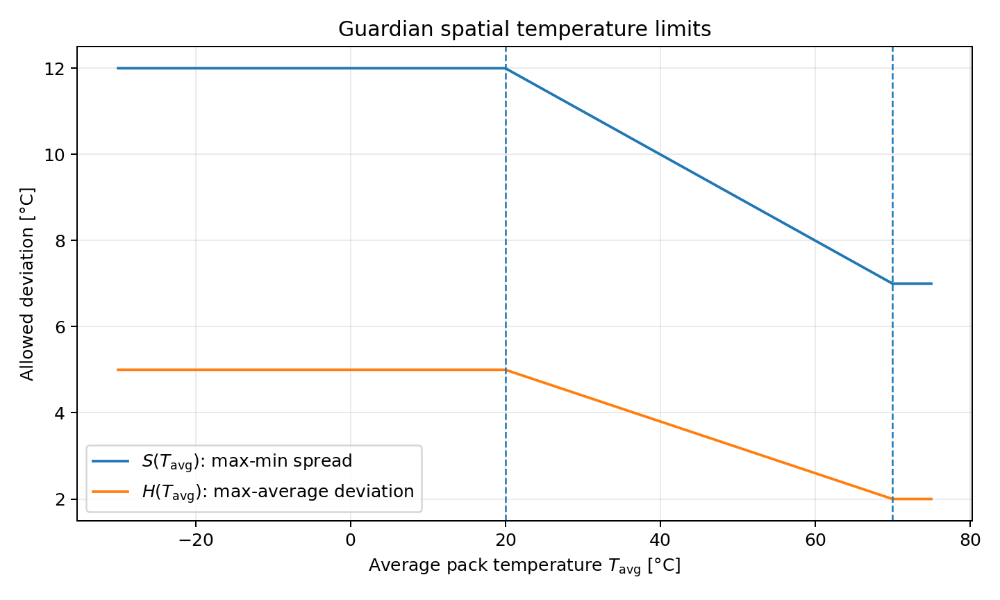
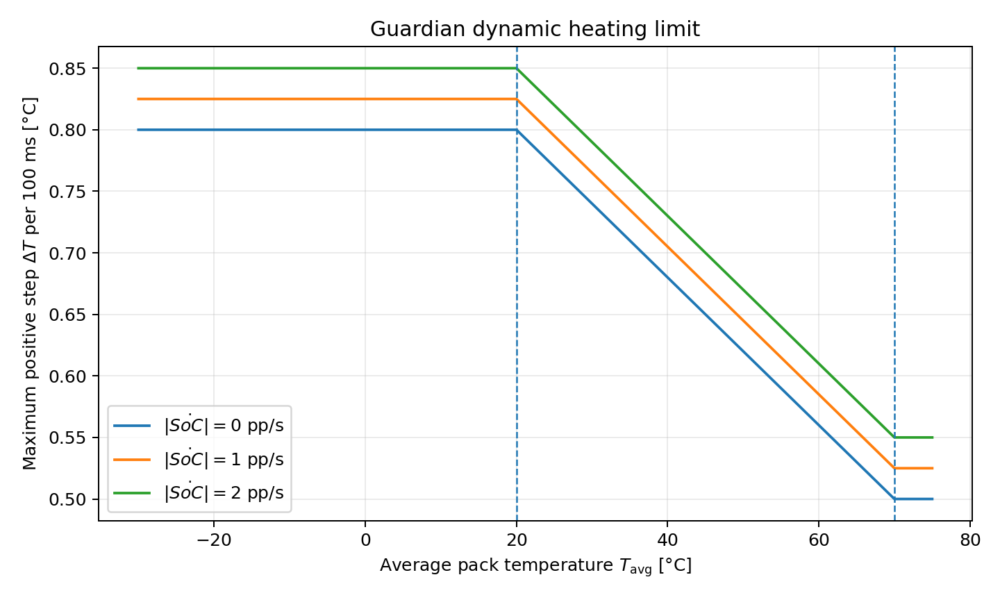
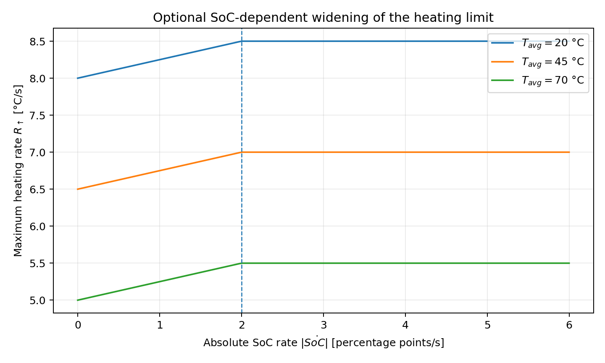

# Battery Guardian: Physical Consistency Model

## 1. Scope

The Guardian observes one sample every $\Delta t=100\,\mathrm{ms}$:

$$
x_k =
\left(
T_{\min,k},
T_{\mathrm{avg},k},
T_{\max,k},
SoC_k
\right).
$$

The VSS/DBC interface provides minimum, average and maximum cell temperature as well as the battery state of charge. The DBC quantization is $0.5\,^\circ\mathrm{C}$ for temperatures and $0.5$ percentage points for SoC; the message cycle time is $100\,\mathrm{ms}$.

The Guardian does **not** estimate a detailed electro-thermal battery model. Instead, it checks a small set of closed-form physical consistency constraints. Each check compares an observed quantity ("IST") against a state-dependent admissible limit ("SOLL").

The model is intentionally simple and campaign-oriented. The numeric values below are model parameters for the demonstrator, not battery-cell qualification limits for a specific chemistry.

---

## 2. Configuration parameters

### 2.1 Sampling and transport

| Parameter | Symbol | Proposed value | Unit | Meaning |
|---|---:|---:|---|---|
| Sample period | $\Delta t$ | 0.1 | s | VSS/DBC sampling interval |
| Temperature quantization | $q_T$ | 0.5 | °C | DBC resolution |
| SoC quantization | $q_{SoC}$ | 0.5 | pp | DBC resolution |
| Stale timeout | $\tau_{\mathrm{stale}}$ | 2.0 | s | No fresh sample beyond this age |
| Watchdog interval | $\tau_{\mathrm{watchdog}}$ | 0.5 | s | Stream freshness check interval |

Here and below, `pp` means percentage points.

### 2.2 Absolute state limits

| Parameter | Symbol | Proposed value | Unit |
|---|---:|---:|---|
| Absolute minimum battery temperature | $T_{\mathrm{abs,min}}$ | -30 | °C |
| Absolute maximum battery temperature | $T_{\mathrm{abs,max}}$ | 70 | °C |
| Minimum SoC | $SoC_{\min}$ | 0 | % |
| Maximum SoC | $SoC_{\max}$ | 100 | % |

### 2.3 Thermal state normalization

The temperature-dependent limits use a normalized thermal state

$$
\theta(T) =
\operatorname{clip}
\left(
\frac{T-T_{\mathrm{ref}}}
     {T_{\mathrm{hot}}-T_{\mathrm{ref}}},
0,1
\right).
$$

Parameters:

| Parameter | Symbol | Proposed value | Unit |
|---|---:|---:|---|
| Reference temperature | $T_{\mathrm{ref}}$ | 20 | °C |
| Hot-state temperature | $T_{\mathrm{hot}}$ | 70 | °C |

Thus,

$$
\theta(T)=
\begin{cases}
0, & T\le20^\circ\mathrm{C},\\[2mm]
\dfrac{T-20}{50}, & 20<T<70^\circ\mathrm{C},\\[3mm]
1, & T\ge70^\circ\mathrm{C}.
\end{cases}
$$

The state variable is deliberately saturated. Temperatures outside the physical range are handled independently by the absolute-limit check.

### 2.4 Spatial consistency parameters

| Parameter | Symbol | Cold value | Hot value | Unit |
|---|---:|---:|---:|---|
| Maximum pack spread | $S$ | $S_{\mathrm{cold}}=12$ | $S_{\mathrm{hot}}=7$ | °C |
| Maximum hotspot deviation | $H$ | $H_{\mathrm{cold}}=5$ | $H_{\mathrm{hot}}=2$ | °C |

### 2.5 Dynamic consistency parameters

| Parameter | Symbol | Proposed value | Unit |
|---|---:|---:|---|
| Maximum heating rate, cold state | $R_{\uparrow,\mathrm{cold}}$ | 8 | °C/s |
| Maximum heating rate, hot state | $R_{\uparrow,\mathrm{hot}}$ | 5 | °C/s |
| Maximum cooling magnitude | $R_{\downarrow}$ | 6 | °C/s |
| SoC-to-heating coupling | $K_{SoC}$ | 0.25 | °C/pp |
| SoC-rate coupling cap | $Q_{\mathrm{cap}}$ | 2 | pp/s |
| Maximum SoC step | $\Delta SoC_{\max}$ | 0.5 | pp/sample |

The SoC coupling is intentionally weak and capped. It is optional; setting

$$
K_{SoC}=0
$$

reduces the v1 model to a temperature-only dynamic bound without changing any other formula.

### 2.6 Stuck detection parameters

A raw rule such as "five identical samples" is not suitable because the temperature signals are quantized to $0.5\,^\circ\mathrm C$ and a healthy battery can legitimately remain unchanged over many 100-ms samples.

Instead, stuck detection uses a window and requires excitation elsewhere:

| Parameter | Symbol | Proposed value | Meaning |
|---|---:|---:|---|
| Window length | $N_{\mathrm{stuck}}$ | 10 samples | 1 s observation window |
| Flatness tolerance | $\epsilon_{\mathrm{stuck}}$ | 0.25 °C | below half one temperature LSB |
| Temperature excitation | $E_T$ | 1.0 °C | another temperature channel changes sufficiently |
| SoC excitation | $E_{SoC}$ | 1.0 pp | SoC changes sufficiently |

This detector is intended primarily for the controlled fault campaign. Without independent excitation or source metadata, a constant physical signal and a frozen sensor cannot always be distinguished.

---

## 3. Generic SOLL-IST formulation

For every invariant, define

$$
r_k = \mathrm{IST}_k-\mathrm{SOLL}_k.
$$

A positive residual indicates a violation:

$$
\boxed{r_k>0 \quad\Longrightarrow\quad \text{fault condition}}
$$

where appropriate, the residual is formed from the maximum of multiple one-sided violations.

This convention allows the Guardian to report the same generic evidence fields:

- `observed`: the actual measured quantity,
- `limit`: the state-dependent admissible limit,
- `residual`: `observed - limit`,
- `detection_class`: the violated invariant.

---

## 4. Physical consistency checks

### 4.1 Absolute temperature limit

Required condition:

$$
T_{\mathrm{abs,min}}
\le T_{\min,k}
\le T_{\max,k}
\le T_{\mathrm{abs,max}}.
$$

Residual:

$$
r_{\mathrm{abs},k}
=
\max
\left(
T_{\mathrm{abs,min}}-T_{\min,k},
T_{\max,k}-T_{\mathrm{abs,max}}
\right).
$$

Fault condition:

$$
r_{\mathrm{abs},k}>0.
$$

Guardian detection class:

```text
PHYSICAL_TEMP_ABSOLUTE_LIMIT
```

---

### 4.2 Temperature ordering

Required condition:

$$
T_{\min,k}
\le
T_{\mathrm{avg},k}
\le
T_{\max,k}.
$$

Residual:

$$
r_{\mathrm{ordering},k}
=
\max
\left(
T_{\min,k}-T_{\mathrm{avg},k},
T_{\mathrm{avg},k}-T_{\max,k}
\right).
$$

Fault condition:

$$
r_{\mathrm{ordering},k}>0.
$$

Guardian detection class:

```text
PHYSICAL_TEMP_ORDERING
```

---

### 4.3 Temperature spread across the pack

The admissible maximum spread shrinks as the pack becomes hotter:

$$
S(T)
=
S_{\mathrm{cold}}
-
\left(
S_{\mathrm{cold}}-S_{\mathrm{hot}}
\right)
\theta(T).
$$

With the proposed parameters:

$$
\boxed{
S(T)
=
12-5\,\theta(T)
}
$$

in degrees Celsius.

Observed spread:

$$
S_{\mathrm{obs},k}
=
T_{\max,k}-T_{\min,k}.
$$

Residual:

$$
r_{\mathrm{spread},k}
=
S_{\mathrm{obs},k}
-
S(T_{\mathrm{avg},k}).
$$

Fault condition:

$$
r_{\mathrm{spread},k}>0.
$$

Guardian detection class:

```text
PHYSICAL_TEMP_SPREAD
```



---

### 4.4 Hotspot deviation from the pack average

The hottest cell may only deviate by a state-dependent amount from the pack average:

$$
H(T)
=
H_{\mathrm{cold}}
-
\left(
H_{\mathrm{cold}}-H_{\mathrm{hot}}
\right)
\theta(T).
$$

With the proposed parameters:

$$
\boxed{
H(T)
=
5-3\,\theta(T)
}
$$

in degrees Celsius.

Observed hotspot deviation:

$$
H_{\mathrm{obs},k}
=
T_{\max,k}-T_{\mathrm{avg},k}.
$$

Residual:

$$
r_{\mathrm{hotspot},k}
=
H_{\mathrm{obs},k}
-
H(T_{\mathrm{avg},k}).
$$

Fault condition:

$$
r_{\mathrm{hotspot},k}>0.
$$

Guardian detection class:

```text
PHYSICAL_TEMP_HOTSPOT
```

The spread and hotspot checks are intentionally separate:

- `SPREAD` detects excessive non-uniformity over the complete pack.
- `HOTSPOT` detects the hottest cell diverging from the thermal bulk of the pack.

---

## 5. Dynamic temperature consistency

### 5.1 Measured temperature rate

For each temperature signal

$$
i\in\{\min,\mathrm{avg},\max\},
$$

compute

$$
\dot T_{i,k}
=
\frac{T_{i,k}-T_{i,k-1}}{\Delta t}.
$$

For the state-dependent limit, the **previous** average temperature is used:

$$
T_{\mathrm{state},k}=T_{\mathrm{avg},k-1}.
$$

This keeps the check causal and prevents the current anomalous sample from relaxing its own limit.

### 5.2 Base heating limit

$$
R_{\uparrow,\mathrm{base}}(T)
=
R_{\uparrow,\mathrm{cold}}
-
\left(
R_{\uparrow,\mathrm{cold}}
-
R_{\uparrow,\mathrm{hot}}
\right)
\theta(T).
$$

With the proposed parameters:

$$
\boxed{
R_{\uparrow,\mathrm{base}}(T)
=
8-3\,\theta(T)
}
\quad [^\circ\mathrm C/\mathrm s].
$$

### 5.3 Optional SoC-dependent widening

The instantaneous SoC rate is

$$
\dot{SoC}_k
=
\frac{SoC_k-SoC_{k-1}}{\Delta t}.
$$

For the thermal coupling, use a capped absolute value

$$
Q_k
=
\min
\left(
|\dot{SoC}_k|,
Q_{\mathrm{cap}}
\right).
$$

Then

$$
\boxed{
R_\uparrow(T,Q)
=
R_{\uparrow,\mathrm{base}}(T)
+
K_{SoC}Q
}
$$

or numerically

$$
\boxed{
R_\uparrow(T,Q)
=
8-3\theta(T)+0.25Q
}.
$$

This is not intended as a detailed electro-thermal model. It only expresses the weak assumption that substantial charging/discharging may justify a somewhat larger positive temperature gradient.

The cap ensures that a corrupted SoC signal cannot arbitrarily relax the temperature plausibility bound.

### 5.4 Cooling limit

Cooling is bounded independently:

$$
\boxed{
-R_\downarrow
\le
\dot T_{i,k}
}
$$

with

$$
R_\downarrow=6\,^\circ\mathrm C/\mathrm s.
$$

### 5.5 Complete dynamic condition

For every $i\in\{\min,\mathrm{avg},\max\}$:

$$
\boxed{
-R_\downarrow
\le
\dot T_{i,k}
\le
R_\uparrow
\left(
T_{\mathrm{avg},k-1},
Q_k
\right)
}
$$

The one-sided residual can be written as

$$
r_{\mathrm{rate},i,k}
=
\max
\left(
\dot T_{i,k}-R_\uparrow,
-\dot T_{i,k}-R_\downarrow
\right).
$$

The aggregate residual is

$$
r_{\mathrm{rate},k}
=
\max_i
r_{\mathrm{rate},i,k}.
$$

Fault condition:

$$
r_{\mathrm{rate},k}>0.
$$

Guardian detection class:

```text
PHYSICAL_TEMP_RATE
```

For a fixed 100-ms sample period, the positive per-sample bound is

$$
\Delta T_{\uparrow,\max}
=
\Delta t\cdot R_\uparrow.
$$



The proposed temperature-only base limit therefore decreases from

$$
0.8\,^\circ\mathrm C/\text{sample}
$$

at the cold/reference state to

$$
0.5\,^\circ\mathrm C/\text{sample}
$$

at the hot state.

The weak SoC coupling is shown separately:



---

## 6. State-of-charge consistency

### 6.1 SoC range

Required condition:

$$
SoC_{\min}
\le SoC_k
\le SoC_{\max}
$$

with

$$
SoC_{\min}=0,\qquad SoC_{\max}=100.
$$

Residual:

$$
r_{\mathrm{soc-range},k}
=
\max
\left(
SoC_{\min}-SoC_k,
SoC_k-SoC_{\max}
\right).
$$

Fault condition:

$$
r_{\mathrm{soc-range},k}>0.
$$

Guardian detection class:

```text
PHYSICAL_SOC_RANGE
```

### 6.2 SoC step/rate

Because the DBC quantization is $0.5$ percentage points, the v1 model uses a per-sample step bound:

$$
\Delta SoC_k
=
SoC_k-SoC_{k-1}.
$$

Required condition:

$$
\boxed{
|\Delta SoC_k|
\le
\Delta SoC_{\max}
}
$$

with

$$
\Delta SoC_{\max}=0.5\ \text{pp/sample}.
$$

Residual:

$$
r_{\mathrm{soc-rate},k}
=
|\Delta SoC_k|
-
\Delta SoC_{\max}.
$$

Fault condition:

$$
r_{\mathrm{soc-rate},k}>0.
$$

Guardian detection class:

```text
PHYSICAL_SOC_RATE
```

Equivalently, for $\Delta t=0.1\,\mathrm s$,

$$
|\dot{SoC}_k|
\le
5\ \text{pp/s}.
$$

The per-sample formulation is preferable here because it directly reflects the signal quantization.

---

## 7. Signal-stuck detection

For one signal $x$ over the last $N_{\mathrm{stuck}}$ samples, define the observed range

$$
A_x(k)
=
\max_{j=k-N+1,\ldots,k}x_j
-
\min_{j=k-N+1,\ldots,k}x_j.
$$

The signal is locally flat if

$$
A_x(k)\le\epsilon_{\mathrm{stuck}}.
$$

For a temperature signal $T_i$, define external excitation as

$$
E_i(k)
=
\left[
\max_{j\ne i} A_{T_j}(k)\ge E_T
\right]
\lor
\left[
|SoC_k-SoC_{k-N+1}|\ge E_{SoC}
\right].
$$

Then

$$
\boxed{
\mathrm{stuck}_i(k)
=
\left[
A_{T_i}(k)\le\epsilon_{\mathrm{stuck}}
\right]
\land
E_i(k)
}
$$

with proposed values

$$
N_{\mathrm{stuck}}=10,\qquad
\epsilon_{\mathrm{stuck}}=0.25^\circ\mathrm C,\qquad
E_T=1.0^\circ\mathrm C,\qquad
E_{SoC}=1.0\ \mathrm{pp}.
$$

Guardian detection class:

```text
SIGNAL_STUCK
```

This deliberately avoids classifying a thermally steady battery as faulty merely because the same quantized temperature value is observed repeatedly.

---

## 8. Stream freshness

Let $t_{\mathrm{last}}$ be the receive time of the most recent fresh battery event.

Stream age:

$$
a(t)
=
t-t_{\mathrm{last}}.
$$

Required condition:

$$
a(t)\le\tau_{\mathrm{stale}}.
$$

Residual:

$$
r_{\mathrm{stale}}(t)
=
a(t)-\tau_{\mathrm{stale}}.
$$

Fault condition:

$$
r_{\mathrm{stale}}(t)>0.
$$

With

$$
\tau_{\mathrm{stale}}=2.0\,\mathrm s.
$$

Guardian detection class:

```text
STREAM_STALE
```

This is intentionally a **symptom** classification. In the current campaign, the following injected root causes may all lead to the same Guardian observation:

```text
transport.delay  --\
transport.drop   ---+--> STREAM_STALE
source.dropout   --/
```

The Evidence Collector must therefore use campaign ground truth to distinguish the injected class.

---

## 9. Complete per-sample Guardian evaluation

For each new sample $k$:

1. Decode
   $$
   T_{\min,k},T_{\mathrm{avg},k},T_{\max,k},SoC_k.
   $$

2. Check absolute temperature bounds:
   $$
   r_{\mathrm{abs},k}.
   $$

3. Check ordering:
   $$
   r_{\mathrm{ordering},k}.
   $$

4. Compute thermal state:
   $$
   \theta_k=\theta(T_{\mathrm{avg},k}).
   $$

5. Compute spatial limits:
   $$
   S_k=S(T_{\mathrm{avg},k}),\qquad
   H_k=H(T_{\mathrm{avg},k}).
   $$

6. Compare spatial IST values:
   $$
   T_{\max,k}-T_{\min,k}
   \quad\text{and}\quad
   T_{\max,k}-T_{\mathrm{avg},k}
   $$
   against $S_k$ and $H_k$.

7. If a previous sample exists, compute:
   $$
   \dot T_{\min,k},\dot T_{\mathrm{avg},k},\dot T_{\max,k},
   \dot{SoC}_k.
   $$

8. Compute the dynamic heating limit from the previous thermal state:
   $$
   R_{\uparrow,k}
   =
   R_\uparrow(T_{\mathrm{avg},k-1},Q_k).
   $$

9. Check temperature dynamics and SoC step.

10. Update the stuck-detection windows.

11. On every fault-state transition, emit a `GuardianEvidenceEvent`.

Separately, the watchdog evaluates stream freshness even when no new sample arrives.

---

## 10. Recommended Guardian evidence payload

For every state transition, the Guardian should expose enough data for the Evidence Collector to reproduce the SOLL-IST decision:

```yaml
run_id: ...
detection_class: PHYSICAL_TEMP_SPREAD
fault_id: BatteryTempSpreadViolation
state: active
detected_at_ms: ...

context:
  temp_min: 42.0
  temp_avg: 47.0
  temp_max: 55.0
  soc: 68.5

  observed: 13.0
  limit: 9.3
  residual: 3.7

  model_variable: "temp_max-temp_min"
  state_variable: 47.0
```

For a dynamic violation, the context should additionally include the previous sample or derived rate:

```yaml
context:
  signal: temp_max
  previous: 48.0
  current: 49.0
  delta_t_s: 0.1
  observed: 10.0       # degC/s
  limit: 6.5           # degC/s
  residual: 3.5
```

The Collector should not need to reimplement the physical model to decide whether the Guardian detected a violation. It should, however, receive `observed`, `limit`, and `residual` so that the detection is auditable.

---

## 11. Mapping to the current v1 fault campaign

| Injected class | Primary Guardian observation |
|---|---|
| `signal.stuck` | `SIGNAL_STUCK` |
| `signal.spike` | `PHYSICAL_TEMP_RATE` |
| `signal.drift` | `PHYSICAL_TEMP_SPREAD`, `PHYSICAL_TEMP_HOTSPOT` |
| `signal.out_of_range` | `PHYSICAL_TEMP_ABSOLUTE_LIMIT` |
| `transport.delay` | `STREAM_STALE` |
| `transport.drop` | `STREAM_STALE` |
| `source.dropout` | `STREAM_STALE` |

A spike may legitimately violate more than one physical invariant. `PHYSICAL_TEMP_RATE` is the intended primary observation for the campaign scenario; the injected spike should therefore remain inside the absolute temperature range when possible.

Likewise, the drift scenario should remain within the per-sample rate limit and gradually violate the spread/hotspot constraints. This isolates the intended fault mechanism.

---

## 12. Compact parameter block

A direct implementation-oriented configuration could look like:

```yaml
guardian_model:
  sample_period_ms: 100

  temperature:
    absolute_min_c: -30.0
    absolute_max_c: 70.0
    reference_c: 20.0
    hot_state_c: 70.0

    spread:
      cold_c: 12.0
      hot_c: 7.0

    hotspot:
      cold_c: 5.0
      hot_c: 2.0

    dynamics:
      heating_rate_c_per_s:
        cold: 8.0
        hot: 5.0
      cooling_rate_c_per_s: 6.0

      soc_coupling:
        gain_c_per_pp: 0.25
        rate_cap_pp_per_s: 2.0

  soc:
    min_percent: 0.0
    max_percent: 100.0
    max_step_pp: 0.5

  stuck:
    window_samples: 10
    flatness_epsilon_c: 0.25
    temperature_excitation_c: 1.0
    soc_excitation_pp: 1.0

  stream:
    stale_timeout_ms: 2000
    watchdog_interval_ms: 500
```

For the simplest possible first implementation, the SoC-to-temperature coupling can be disabled with

```yaml
gain_c_per_pp: 0.0
```

without changing the remainder of the Guardian model.
